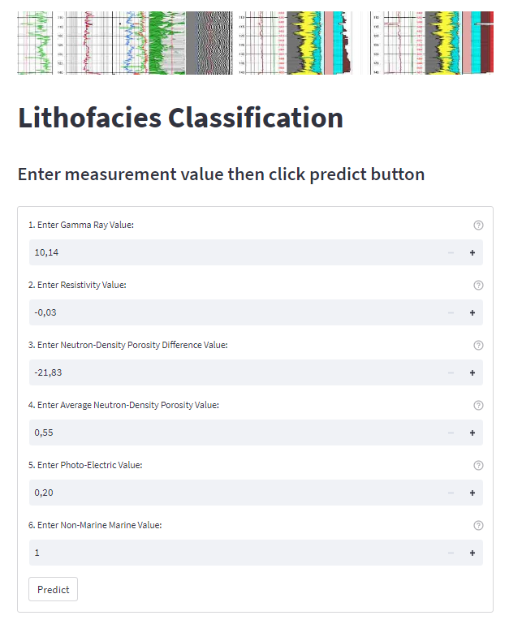
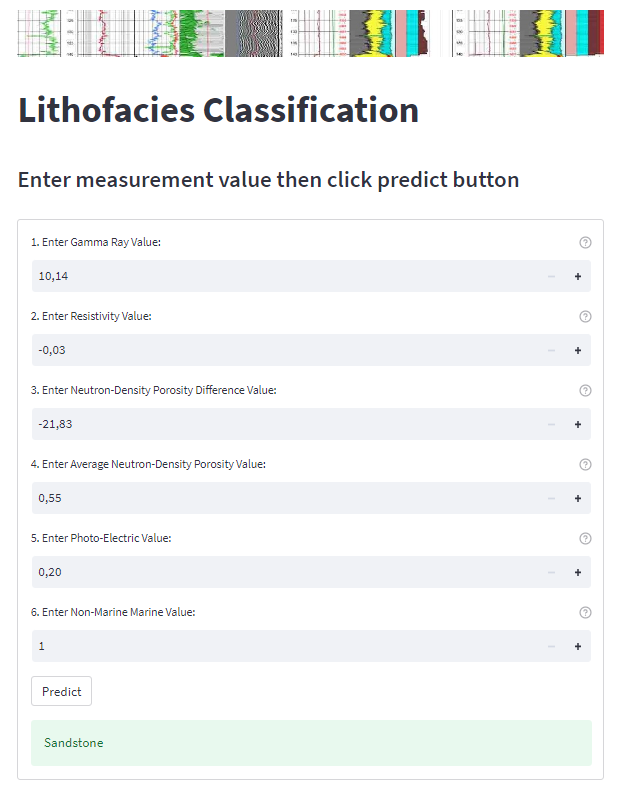

# FACIES CLASSIFICATION USING SUPERVISED MACHINE LEARNING MODEL

## A. PROBLEM & GOAL
### A.1. PROBLEMS
- Oil and Gas companies need to translate well measurement data into lithofacies layer to better understand the condition of the reservoir being drilled.
- Manually interpreting well measurement data that are exponentially growing in volume by reservoir geologists or geophysicists must be subjective to some extent, leading to increased uncertainties.
Facies definition is sometimes very time-consuming activity and expensive.
### A.2. GOALS
- The goal of this project is to find the best-supervised machine learning algorithm for lithofacies classification, and then deploy the pre-application to the server to predict the lithofacies from the well-measurement data

## B. PROJECT ARCHITECTURE
### .github/workflows
- Contain script python-app.yaml for CI/CD through github action
### .ssh
- Contain .pem file to login into AWS EC2 Instance
### config
- Contain text file config.yaml as configuration file for this project
### data
- Contain processed and raw data for machine learning model training. Raw data in .csv format consist of 10 well measurement data. Processed data contain pickle from raw, train, test, and modeling data. 
## docker
- Contain docker script and its dependencies for constructing docker image in local and at docker Hub. There are 2 docker image, first docker is to serve the API service, and the second docker is to serve the streamlit services. Each of the come with different requirement.txt
## image
- Contain image for designing README and streamlit purpose
## log 
- Contain training log to record activity inside this directory
## models
- contain pickle file from machine learning model, and decoder such as ohe decoder and standard_scaler for data preprocessing or feature engineering
## src 
- contain python executable script for this project. There are data_preprocessing.py for preprocessing data, feature_engineering.py for engineering data train and test feature for modeling, modeling.py to build the machine learning model, util.py to contain common function, api.py to construct the fastapi, front_end.py to construct the streamlit as front end and unit_test.py for unit testing function in this scripts. 
## .gitignore
- contain statement to exclude python virtual machine folder push into github
## docker_compose.yaml 
- File for accomodating Dockerfile in api and Dockerfile in streamlit folder. This docker_compose will be use to create 2 docker image (api and streamlit) and can be used in CI/CD pipeline or in local
## python notebook files
- File for project experiment, consist of data_pipeline.ipynb, feature_engineering.ipynb, modeling.ipynb, and exploratory_and_data_analysis.ipynb. Contain experiment function that will create the python script at src folder
## requirement.txt
- contain list of dependencies library to construct python virtual machine to run this project in local or remote server. 

## C. PROJECT WORKFLOW

- data preprocessing, feature engineering, and modeling was carried out int the local device. After model can be deployed in local device the repository then pushed into cloud storage github, and with the use of github action we could create CI/CD pipeline to store the docker image in Docker Hub repository and execute the machine learning application in AWS instance EC2 in the cloud.

## D. API DATA REQUIREMENT 

- API data consist of 5 value of wireline measurement and 1 geological category value

| API Input Data | Range Value | Data Type
| ----------- | ----------- | ---- |
| GR      | 10.14 to 361.15    | float64
| ILD_log10   | -0.03 to 1.8   | float64
| DeltaPHI  | -21.83 to 19.31  | float64
| PHIND   | 0.55 to 84.4       | float64
| PE  | 0.2 to 8.09            | float64
| NM_M   | 1 or 2| int32 |

front end was set, so the value entering the model inside the range value, hence the model wont be error if there are no data entering the model. This is one of the defense in this facies classification prediction model. 

as you can see the steramlit front end consist of several value box to give the model value of wireline measurement to predict the facies label. For first experiment I made this very simple just to test whether the model can be deployed into the cloud server or not.

## E. RESPONSE PREDICTION

Response prediction will show as streamlit success object shown under the value input box. Error value also will be shown at the sampe place if there are error when predicting the facies label

## F. NOTES FOR FURTHER IMPROVEMENT
- This project can be improved to predict a sequence of well measurement data by depth, so entire well lithofacies can be predicted
- The modeling also can be expanded to not just supervised machine learning but we can use deep learning to predict the lithofacies inside the oil well to be more accurate prediction

## G. REFERENCE
- [1] Imamverdiyev, Y., Sukhostat, L., 2019, Lithological facies classification using deep convolutional neural network. Journal of Petroleum Science and Engineering 174 (2019) 216–228
- [2] M. Gifford, C. Agah, A., 2010, Collaborative multi-agent rock facies classification from wireline well log data, Engineering Applications of Artificial Intelligence 23 (2010) 1158–1172
- [3] W. Dunham, M. Malcolm, A. Kim Welford, J. 2020, Improved well log classification using semisupervised Gaussian mixture models and a new hyper-parameter selection strategy, Computers and Geosciences 140 (2020) 104501
- [4] W.J. Glover P., K. Mohammed-Sajed, O., Akyiiz, C., Lorinczi, P. 2022, Clustering of facies in tight carbonates using machine learning, Marine and Petroleum Geology 144 (2022) 105828
- [5] Antariksa, G. Muamar, R. Lee, J. 2022, Performance evaluation of machine learning-based classification with rock-physics analysis of geological lithofacies in Tarakan Basin, Indonesia, Journal of Petroleum Science and Engineering 208 (2022) 109250
